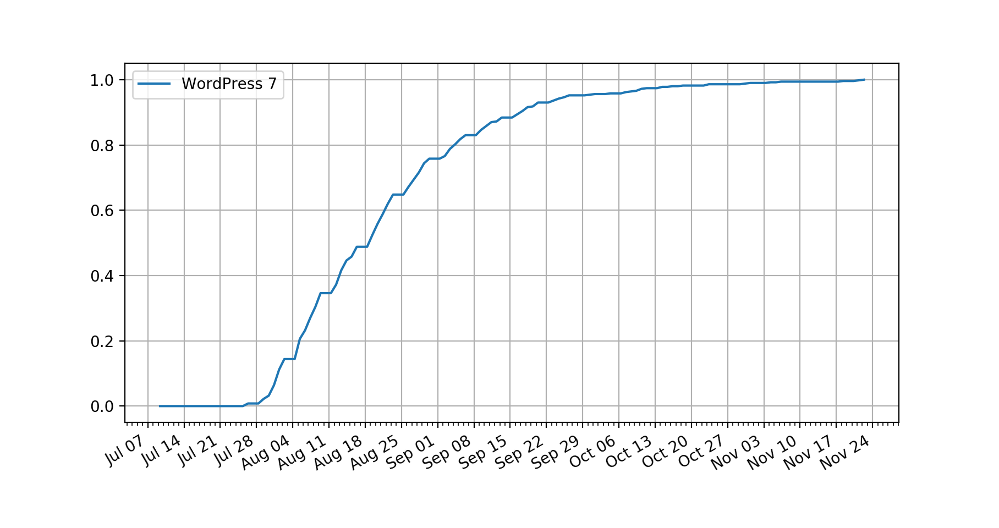

# Contracting

## Discovery

## Contract & Proposal

I will draft a contract which will also act as the project proposal. My contracts usually contain the following sections:

- **Primary Objectives:** At a high level, what are we seeking to achieve within this contract?
- **Risks & Mitigations:** What could go wrong, and what will we do to reduce the likelihood and severity of these risks?
- **Task Breakdown:** What are the specific tasks I will be completing as a part of the contract?
- **Deliverables:** Whether it be code, designs, documents, or something else entirely, what are the physical or digital goods I will be delivering to the client? How will these items be delivered?
- **Timeline:** When will this contract be completed?
- **Client Responsibilities:** What is the client expected to do in order to facilitate the completion of the contract?
- **Cancellation:** Under what circumstances can the contract be cancelled, and how will cancellations be handled?

A few of these sections deserve more explanation:

### Timeline

I take a very data-driven approach to forecasting contract completion dates. I provide clients with forecasts based on my past performance in predicting task duration. This is fairer to the client, as there is no way to guarantee that a contract will be completed by a specific date.

If the client wishes to set a deadline for the contract, I will provide a percentage probablity that I will meet that deadline given the tasks contained in the contract, the time I have available to devote to the contract, and historical scheduling preformance data gathered from previous contracts. I will also revise this number in each of my regular contract update emails as I work through the contract.

If a deadline is not necessary, I will inform the client with a chart of future dates and the percentage likelihood that the contract will be completed at each date. These charts will look something like this, where the predicted likelihood of completion by a specific date is represented as a decimal between 0 and 1:

### Cancellation

Below is my standard cancellation policy. Note that it may need to be adapted given a specific contract's requirements.

> Both the client and the contractor are free to cancel the project at any time. If the project should be cancelled, the client agrees to pay the percentage of tasks signed off on, multiplied by the total project’s price, within 30 days of notice of cancellation.

## Execution

At a minimum, I keep my clients updated via email once every one to two weeks. Communication between these regular updates is done on an as-needed basis. Contracts with unusual or specific communication needs should have these details noted in the contract.

## Billing

The client is expected to pay the full value of the contract within 30 days of satisfactory completion of the contract. If the contract is cancelled for any reason, the client is expected to pay the amount dictated by the cancellation policy within 30 days of the cancellation.
